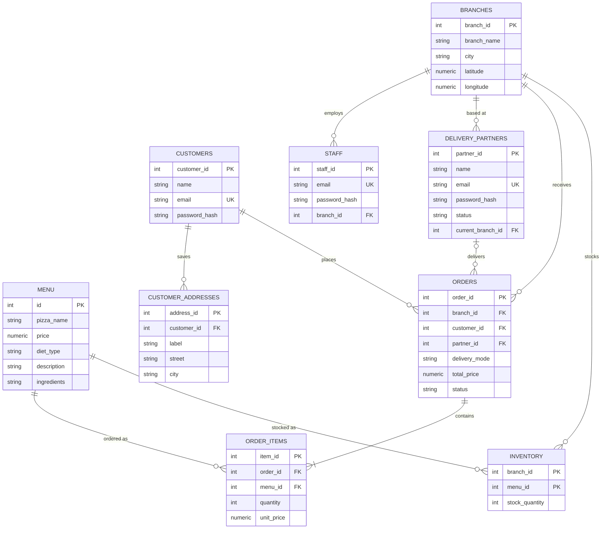

# Lakebase Setup Demo

A small, runnable companion to the blog post **"Lakebase, Hands-On: Postgres That Branches Like Git."** It loads a real schema and seed data into a [Databricks Lakebase](https://docs.databricks.com/aws/en/oltp/) (managed Postgres) project, so you can go from an empty project to a populated, queryable database in one **Run All**.

The schema comes from *Data on Tap*, a pizza-ordering app built on Lakebase — nine tables with branches, a menu, per-branch inventory, customers, and orders. It's ordinary Postgres DDL: your existing schema, drivers, and SQL move over unchanged.

## What's here

| File | What it does |
| --- | --- |
| `setup_database.py` | Databricks notebook. Connects to your Lakebase project, runs `schema.sql` then `seed.sql`, and verifies. Re-running **resets** the demo tables. |
| `schema.sql` | DDL for all nine tables. Drops and recreates them, so re-running wipes any existing data. |
| `seed.sql` | Seed data — branches, menu, inventory, demo customers, staff, delivery partners. |
| `backend/db.py` | All connection logic behind `get_connection()`. Mints a short-lived OAuth token via the Databricks SDK — never a static password. |

## Prerequisites

- A Databricks workspace. [Free Edition](https://login.databricks.com/?dbx_source=docs&intent=CE_SIGN_UP) is enough.
- A **Lakebase project** already created (app switcher → **Lakebase Postgres** → **Autoscaling** → **New project**). Note its name — you'll need it below.
- Basic Postgres familiarity. New to it? The [official PostgreSQL tutorial](https://www.postgresql.org/docs/current/tutorial.html) is the fastest way in.

> **Region note:** a Lakebase project is created in your workspace's region, and not every region supports Lakebase yet. If you don't see **Lakebase Postgres** in the app switcher, check the [supported regions](https://docs.databricks.com/aws/en/oltp/projects/manage-projects#region-availability) first.

## Run it

1. **Get the files into Databricks.** Either clone the repo into Databricks Repos — **Workspace → Repos → Add repo** (or **Create → Git folder**), paste `https://github.com/sagaromar95/lakebase-setup-demo.git`, and create (no login needed, since it's public) — or, if you'd rather skip git, **Download ZIP** from the GitHub page and import `setup_database.py` via **Workspace → Import**. More detail: [Databricks Repos](https://docs.databricks.com/aws/en/repos/).
2. **Open `setup_database.py`.** Attach it to serverless compute.
3. **Edit the config cell** at the top of the notebook:
   - `INSTANCE_NAME` — your Lakebase **project name**. This is the one value you must change.
   - `DATABASE_NAME` — leave as `databricks_postgres` (the default database every project ships with).
   - Leave `RUN_SCHEMA`, `RUN_SEED`, and `VERIFY` as `True`.
4. **Run All.**

The notebook connects, creates the tables, loads the seed data, and prints the table list with row counts. Running it again is a **reset**, not a merge: `schema.sql` drops and recreates every table and `seed.sql` reloads from scratch, so any rows you added — orders included — are erased. Point it only at a throwaway demo project.

## How the connection works

No password is stored anywhere. `backend/db.py` resolves your project's read-write endpoint through the Databricks SDK, mints a short-lived OAuth token in code, and hands it to `psycopg2`:

```python
from databricks.sdk import WorkspaceClient
import psycopg2

w = WorkspaceClient()
endpoint = _pick_endpoint(w)                                   # w.postgres.list_endpoints(...)
host  = endpoint.status.hosts.host
token = w.postgres.generate_database_credential(endpoint=endpoint.name).token

conn = psycopg2.connect(
    host=host, dbname="databricks_postgres",
    user=w.current_user.me().user_name, password=token, sslmode="require",
)
```

`psycopg2` already ships on the Databricks runtime — don't `pip install` another copy.

## The schema (nine tables)

`branches`, `customers`, `delivery_partners`, `customer_addresses`, `staff`, `menu`, `inventory`, `orders`, `order_items`. Inventory is per-branch (`PRIMARY KEY (branch_id, menu_id)`), and `orders` is the hub that ties a branch, a customer, and line items together.



## Connecting from your own machine

Prefer `psql`? Open the project's **Connect** dialog in the Lakebase app, copy the connection string, and:

```bash
# token from the Connect dialog; it's short-lived (~1 hour)
export PGPASSWORD='<paste the OAuth token>'
psql 'postgresql://<you>@<host>/databricks_postgres?sslmode=require'
```

Quote the whole string — the `?` in `?sslmode=require` is a shell wildcard.
